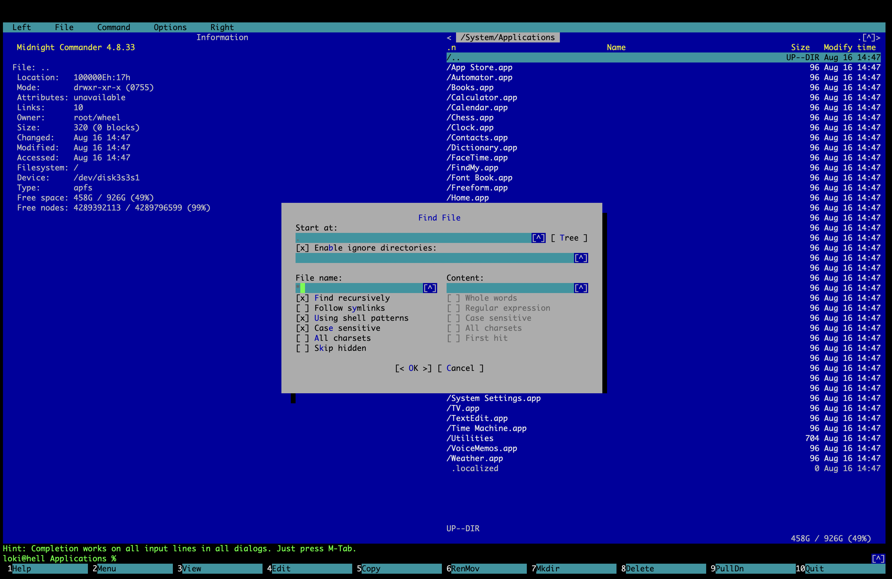

# Midnight Commander on macOS


'Midnight Commander on macOS' is a script to build a macOS-native and minimal `mc` by compiling `autotools` and linking dependency libraries like `libffi` and `glib` statically (without installing them at all). This way, users can enjoy Midnight Commander without using `brew`.  
**NOTE** The script will ask credentials to install `mc` to `/usr/local` at the very last step.  
If you are interested in having the GNU Tools on macOS without using `brew`, take a look at [GNU Tools for macOS](https://github.com/kozyilmaz/tools) repo.

### How To Use
```shell
# run the mc.sh after cloning the repo
$ sh mc.sh
```

### Compiled Tools
```bash
# used for compilation, only installed into temporary directories, not installed to /usr/local
m4
autoconf
automake
libtool
pkg-config
ninja
meson
```

### Compiled Dependencies
```bash
# used as dependencies, only installed into temporary directories as static libraries, not installed to /usr/local
libffi
glib
```

### Final Output
```console
# after the compilation and installation, this is what you will get under /usr/local
$ sw_vers
ProductName:		macOS
ProductVersion:		14.7.8
BuildVersion:		23H730

$ file /usr/local/bin/mc
/usr/local/bin/mc: Mach-O 64-bit executable arm64

$ otool -L /usr/local/bin/mc
/usr/local/bin/mc:
    /usr/lib/libncurses.5.4.dylib (compatibility version 5.4.0, current version 5.4.0)
    /usr/lib/libiconv.2.dylib (compatibility version 7.0.0, current version 7.0.0)
    /usr/lib/libSystem.B.dylib (compatibility version 1.0.0, current version 1351.0.0)
    /System/Library/Frameworks/Carbon.framework/Versions/A/Carbon (compatibility version 2.0.0, current version 170.0.0)
    /System/Library/Frameworks/AppKit.framework/Versions/C/AppKit (compatibility version 45.0.0, current version 2575.30.19)
    /System/Library/Frameworks/CoreFoundation.framework/Versions/A/CoreFoundation (compatibility version 150.0.0, current version 3208.0.0)
    /System/Library/Frameworks/Foundation.framework/Versions/C/Foundation (compatibility version 300.0.0, current version 3208.0.0)
    /System/Library/Frameworks/CoreServices.framework/Versions/A/CoreServices (compatibility version 1.0.0, current version 1226.0.0)
    /usr/lib/libobjc.A.dylib (compatibility version 1.0.0, current version 228.0.0)

$ /usr/local/bin/mc --version
GNU Midnight Commander 4.8.33
Built with GLib 2.85.4
Built with ncurses 6.0
With builtin editor
With subshell support as default
With support for background operations
With mouse support on xterm
With multiple codepages support
Virtual File Systems:
 cpiofs, tarfs, sfs, extfs, ftpfs, shell
Data types:
 char: 8; int: 32; long: 64; void *: 64; size_t: 64; off_t: 64; uintmax_t: 64;
```